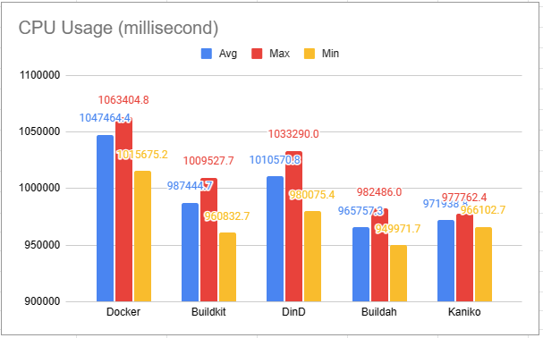
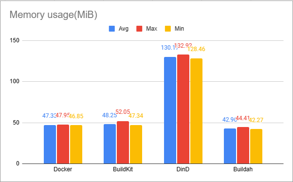
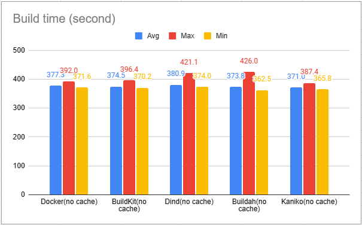
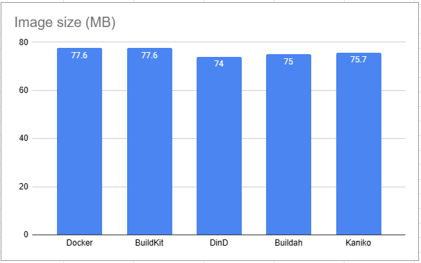

# Image Building Tools Comparison

## 簡介

在這篇文章中，將會簡介目前常見的幾種 Image Building Tools，分別是目前最常見的 Docker 以及新版本內建的 Buildkit、以及常被用在 CICD 過程中的三套 Build tool：Dind(Docker in Docker), Buildah, Kaniko 作比較。

並比較這些工具在 build image 時花費的系統資源：

- Memory
- Build Time
- CPU time
  以及不同工具最後 build 出的 Image Size 是否有所不同，以及探討其中的差異。

## 測試環境

本次 lab 統一使用 CNTUG Infra Labs OpenStack 上的 VM，規格如下：

- Ubuntu 20.04
- 4 cores vCPU
- RAM：4G
- total Disk：30 GB
- 測試方法會在下方 Labs 區塊中詳述

## 測試的 Image

本次 lab 使用 [php-fpm](https://github.com/docker-library/php/blob/master/8.1/alpine3.15/fpm/Dockerfile) 做 image build tool 的數據比較：

| image name | php-fpm     |
| ---------- | ----------- |
| version    | php 8.1     |
| base image | alpine 3.16 |

## 各項工具簡介

### Docker

為目前十分常見的 container solution，榮獲 2022 年 Stack Overflow 開發者大調查開發者最愛工具的第一名，功能齊全，在使用上透過 `docker` 指令進行 container 相關的各種操作。

### Buildkit

Buildkit 為 Docker 推出的實驗性功能，主打更高效能、並行的運作方式，也針對 cache, storage management 等功能做了許多優化，加速了以往使用 docker build image 的流程以及最佳化使用體驗，預設內建在 `Docker 18.09` 版本之後的 docker 內，啟用方式也十分簡易，`DOCKER_BUILDKIT=1 docker build .`即可使用，在 MacOS/Linux 環境下，也可透過建立 `/etc/docker/daemon.json`，並加入以下設定啟用 Buildkit。

```
{
  "features": {
    "buildkit" : true
  }
}
```

### DinD

全名為 Docker-in-Docker，顧名思義，在 docker 中再運行一個 docker container，因此在運行起來的 container 內，也能執行 `docker` 指令，通常會在運行 CICD pipeline 時使用，好處是環境隔離，每次會起新的 Docker daemon，但 build 的時候無法共享 cache，但可以透過 `cache-from` 去指定特定的 image 加入 build 流程。

### Buildah

Buildah 是由 Red Hat 開發，幫助開發者 build 相容 OCI 標準的 container images 的一套工具，在 podman 中預設會安裝 Buildah，但也可以單獨安裝使用，在使用上不須相依於 `Dockerfile`，而是能指定任意包含 build command 的檔案，可直接掛載 container，並對其內容進行操作，增加使用彈性、安全性。

詳細功能介紹可參考[官方 Repo](https://github.com/containers/buildah)

### Kaniko

可參考之前 Lab 撰寫的 [Kaniko 教學](https://docs.cloudnative.tw/docs/self-paced-labs/kaniko/)，Kaniko 適合在 container 或是 k8s cluster 內 build image。

## Labs

### 資源計算

- CPU：在計算 CPU 使用率的部分，透過 `Pseudo-files` 的方式，每次在 build image 時，讀取 `/sys/fs/cgroup/cpuacct/<TOOL_NAME>/$CONTAINER_ID/cpuacct.usage` 去比較 CPU 使用的資源量。
- Memory：使用 time 指令 `/usr/bin/time -v` 列出單一指令消耗的資源，每項工具以同樣的 build 指令執行 15 次，比較最大值、最小值、平均值。
- Image size：在比較過多套 container image 分析工具後，選擇使用 docker 內建的列出 `docker image ls` 查看 image size。
- build time: 使用 time 指令 `/usr/bin/time -v` 查看其中的 `Elapsed (wall clock) time`，同樣比較最大值、最小值、平均值。

### Docker

安裝的版本為 `20.10.17`，主要比較有無 layer caching 的 build process

- 預設有 cache
  ` docker build -t <image-name>:<version> .`
- 不使用 cache
  ` docker build -t <image-name>:<version> . --no-cache`

### DinD

首先運行一個 dind container，並將 Dockerfile 等內容 mount 到 container 內，並開 shell 進到 dind container 中，再 build image，同樣比較有無 layer caching

```shell=
$ docker run -v $PWD:/workspace --privileged -d --name dind-test docker:dind
$ docker exec -it dind-test /bin/sh
$ cd workspace
$ docker build -t <image-name>:<version> .
```

### Buildkit

啟用 Buildkit 後，再下跟 docker build 一樣的指令即可，如果有下載 Docker Desktop，則預設就會啟用

```shell=
$ DOCKER_BUILDKIT=1 docker build .
```

### Buildah

先單獨安裝 Buildah，再下 `buildah bud` 即可開始 build image

```shell=
# 安裝 Buildah
$ sudo apt install buildah
# build image
$ buildah bud -t <image-name>:<version> .
# build image with layers cache
$ buildah bud -t <image-name>:<version> --layers .
# 列出 build 好的 image
$ buildah images
```

### Kaniko

使用 docker 運行 kaniko v1.8.1 的 container，並將 build 好的 image 推到 dockerhub 上

```shell=
$ docker run -v $PWD:/workspace \
  -v ~/.docker/config.json:/kaniko/config.json \
  --env DOCKER_CONFIG=/kaniko gcr.io/kaniko-project/executor:v1.8.1 \
  -d <username>/<image-name>:<version>
```

## 測試結果

### CPU Usage

CPU 資源使用量的部分，如上面 lab 區塊提到，看的檔案是 `cpu usage`，`cpu usage` 為 lab 使用的環境：`vCPU*4` 的資源使用總和，且 build 過程中皆無使用 cache，比較結果如下：

- 平均/最大/最小使用資源，單位為毫秒 (millisecond)
  

從上圖可以看到 Kaniko、Buildah 使用的資源低於 Docker，且略勝 Buildkit，以平均使用量來排序：
Docker>Dind>Buildkit>Kaniko>Buildah

### Memory

比較所使用的 memory，並分為 build 過程是否有使用 cache

- 平均/最大/最小使用資源，單位為 Mib

- 有 cache



- 沒有 cache


從上面兩張圖可以看到在有 cache 的情況下，Dind 的記憶體使用率明顯高於其他 build tool，排除 Dind，使用率平均最低的則是 Buildah 接著是 Kaniko。但在沒有 cache 的情況下，Buildah 卻遠高於其他的 build tool。

### Build Time

Build time 的部分同樣比較有無使用 cache 的情況。

在有使用到 build cache 的情況下，Docker/ BuildKit/ Kaniko 都是在一秒內 build 完，Buildah 則是平均 6 秒，因此此處並無製作圖表，僅製作沒有 cache 的情況下花費的時間做比較。

- 單位為秒



#### Docker cache 機制

`dokcerfile` 中的每條指令可視為一個 layer，在 build 的過程中會比較 Layer 與之前是否相同，若相同在使用 docker build 時會顯示 `Using cache` 以及使用了哪個 cache，cahce 則會存在 `/var/lib/docker/image/overlay2/imagedb/content/sha256` 底下，若是使用 BuildKit，則會顯示 `CACHED`，並拿之前的 build cache 來用，可以大幅減少 build image 的時間，若是 `dockerfile` 內容有更改或是使用到的檔案內容有更改就不用使用到 cache，而是會重新 build layer，且後續的 layer 也會需要重新 build，因此在撰寫 dockerfile 時可以將比較常更改的內容放在 `dokcerfile` 尾端。

### Image Size

在 image size 的部分則可以發現差別並不大

- 單位為 MB



## 各項工具比較

|                             | DinD | Kaniko | Buildah | BuildKit |
| :-------------------------- | ---- | ------ | :------ | -------- |
| run without privileged mode | X    | X      | O       | O        |
| local layer caching         | X    | X      | O       | O        |
| Remote layer caching        | O    | O      | O       | O        |
| need dockerfile             | O    | O      | X       | O        |

## 小結

在此次 lab 中，比較了不同 build tool 的資源使用量以及 build 出來的 image size 以及花費的時間，可以發現每個 build tool 各有優缺，也有一些 tool 的資源使用量與想像的有所不同，但無可否認的是這些工具發展十分迅速，在找資料時也發現有些原本被開發人員詬病的特性已經被修掉了，容器安全性的疑慮也有了其他解法，因此，最佳解仍然是根據開發及維運人員的環境及需求去選擇適合的工具。

## Reference

- Docker 官方文件：https://docs.docker.com/build/buildkit/
- 關於 Dind 優缺點的分析：https://jpetazzo.github.io/2015/09/03/do-not-use-docker-in-docker-for-ci/
- 如何蒐集 docker 使用的 metric：https://www.datadoghq.com/blog/how-to-collect-docker-metrics/
- 測試期間的原始資料：[raw data](https://docs.google.com/spreadsheets/d/1UVv--XWu7zvdlo2D7EHwB3yapG9JX-Pb-5uQwzEIwrY/edit#gid=1245208475)
